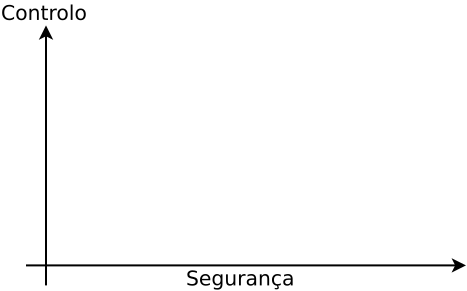
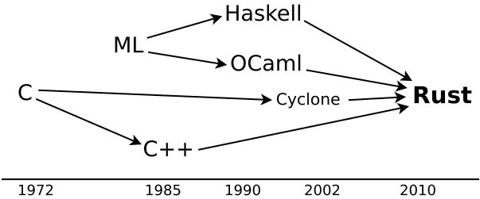

---
title: "À descoberta do *Rust*"
subtitle: "`https://github.com/pbv/rust-taste`"
author: "Pedro Vasconcelos <pbv@dcc.fc.up.pt>"
date: Janeiro 2019
...


# Introdução

## O que é o *Rust*?


Uma linguagem para **programação de sistemas** que combina:

* segurança
* fiabilidade
* *performance* 
* previsibilidade 
* abstrações de alto-nível
 
\

<center>
[https://www.rust-lang.org/](https://www.rust-lang.org/)
</center>

<!--
## Esta apresentação

* Contexto
* Vista geral da linguagem
* Conceitos de *ownership* e *borrowing*

Pre-requisitos:

* conhecimentos básico de C
* opcionais: um pouco de Haskell, C++, Python
-->

## Programação de sistemas?

* *kernels* 
* *device drivers* 
* sistemas embutidos/críticos/tempo real
* sistemas móveis (*smarphones*)
* bibliotecas
* interpretadores e *runtime systems*
* *backends web*
* ...


## Porque não C ou C++?

. . .


<div style="font-size:90%">


> Memory safety errors are today's biggest attack surface for hackers (...)
>The reason for this high percentage is because Windows has been **written mostly in C and C++**, two "memory-unsafe" programming languages.

ZDNet.com, 11 de Fevereiro 2019.
</div>


## Controlo vs. segurança 



. . .

<span style="position: absolute; top:8ex; left:5ex; font-size: 150%;">C</span>

<span style="position: absolute; top:9ex; left:7ex; font-size: 150%;">C++</span>

<span style="position: absolute; top:15ex; left:12ex; font-size: 150%;">Java</span>

<span style="position: absolute; top:15ex; left:18ex; font-size: 150%;">OCaml</span>

<span style="position: absolute; top:17ex; left:22ex; font-size: 150%;">Haskell</span>


<span style="position: absolute; top:9ex; left:22ex; font-size: 150%;">Rust</span>

## Rust: controlo com segurança

* Compilação para código máquina nativo
* Sem *runtime system* ou *garbage collector*
* Controlo sobre a libertação de recursos
     - memória, *file handles*, *locks*
	 - previsibilidade sobre *quando* são libertados
* Ausência de erros de execução
	- *segmentation faults*, *null-pointer exceptions*, 
	*user-after-free*, *race conditions*, ...
* Abstrações de alto-nível 
    - inferência de tipos, encaixe de padrões, funções de ordem superior

## Influências

\




## Quem usa?

--------------  ---------------------------------------------------- 
Mozilla         <span class="smaller">Building the Servo browser engine, integrating into Firefox, other projects</span>
Dropbox         <span class="smaller">Optimizing cloud file storage</span>
Canonical       <span class="smaller">Everything from server monitoring to middleware</span>
npm, Inc        <span class="smaller">Replacing C and rewriting performance-critical bottlenecks in the registry service architecture</span>
Atlassian       <span class="smaller">We use Rust in a service for analyzing petabytes of source code</span>
Chucklefish     <span class="smaller">Video game company using Rust in their new projects to get safe concurrency and portability</span>
--------------  -----------------------------------------------------


<center>
[https://www.rust-lang.org/production/users](https://www.rust-lang.org/production/users)
</center>


# Hello, Rust!

## Hello, world!

```rust
fn main() {
	println!("Hello, world!");
}
```


* `fn` declara a função `main` (sem argumentos)
* `{ ... }` agrupa instruções (como em C/C++)
* `println!` é uma *macro* (assinalada pelo `!`)

Experimentar:
  [https://play.rust-lang.org](https://play.rust-lang.org/?version=stable&mode=debug&edition=2018&gist=030d80f87f53a328f9dc7875cad93e04)

## Variáveis 

Declaradas com `let`:

~~~rust
let x = 5;
~~~

Por omissão são **imutáveis**:

~~~rust
let x = 5;
x += 1; ❌
~~~
~~~
error[E0384]: cannot assign twice to immutable variable `x`
~~~

## Variáveis (cont.)

Declaramos **variáveis mutáveis** explictamente:

~~~rust
let mut x = 5;
x += 1;         // OK
~~~

## Tipos básicos

~~~rust 
i8, i16, i32, i64, ...   // com sinal
u8, u16, u32, u64, ...   // sem sinal
f32, f64           // vírgula flutuante
bool               // booleanos
char, str, String  // carateres, strings
~~~

* A *inferência* permite frequentemente omitir tipos
* Podemos usar anotações para desambiguar

~~~rust 
let x: i32 = 5;
~~~

## Funções

~~~rust
fn max(x: i32, y: i32) -> i32 {
	if x>=y { x } else { y }
}
~~~

* Tipos dos argumentos e resultado (**não** são inferidos)
* O corpo da função é uma **expressão** 
* `return` explícíto para terminar cedo:
  
~~~rust
fun max(x: i32, y: i32) -> i32 {
	if x >= y { return x; }
	y
}
~~~

## Funções (cont.)

* A função retorna um único resultado
* Pode ser um *tuplo*

~~~rust
fn digit(n: u32) -> (u32, u32) {
    (n%10, n/10)
}

fn main() {
	let (d,r) = digit(1234);
	println!("{}, {}", d,r); 
	// imprime 4, 123
}
~~~

<!--
Experimentar: 
[https://play.rust-lang.org/](https://play.rust-lang.org/?version=stable&mode=debug&edition=2018&gist=cf9fc1a1f23c6afe3974e4d85dfaafb2)
-->

<!--

## Efeitos colaterais

Uma função usada pelos efeitos colaterais
retorna o **tuplo vazio**: 

~~~rust
fn greet(name: String) -> () {
   println!("Hello, {}", name);
}
~~~

Podemos omitir o tipo do resultado:

~~~rust
fn greet(name: String) {
   println!("Hello, {}", name);
}
~~~

-->

## Ciclos (1)

Somar os quadrados dos inteiros de 1 a $n$.

~~~rust
fn sum_squares(n: u32) -> u32 {
   let mut s = 0;
   let mut i = 1;
   while i<=n {
	   s += i*i;
	   i += 1;
   }
   s  // resultado 
}
~~~


## Ciclos (2)

Usando um ciclo  `for`:

~~~rust
fn sum_squares(n: u32) -> u32 {
   let mut s = 0;
   for i in 1..n+1 {
	   s += i*i;
   }
   s
}
~~~

* `1..n+1` itera de 1 até $n$ (**não** inclui o limite)
* O âmbito de `i` é o corpo do ciclo

## Ciclos (3)

Versão funcional:

~~~rust
fn sum_squares(n: u32) -> u32 {
	(1..n+1).map(|i| i*i).sum()
}
~~~

* `|i| i*i`{.rust} é uma *função anónima* (expressão-$\lambda$)
* `map()` aplica uma função a um iterador
* `sum()` soma todos os valores 

. . .

<div style="font-size:90%">
Equivalente em Haskell:

~~~haskell
sum_squares n = sum (map (\i->i*i) [1..n])
~~~
</div>

## Estruturas

*Agrupar* múltiplos valores num só:

~~~rust
struct Person {
   name: String,
   age: u32,
}

let alice = Person {
   name: String::from("alice"),
   age: 32
};
~~~

## Enumerações

Optar entre várias *alternativas* mutuamente exclusivas:

~~~rust
enum TrafficLight {
	Green,
	Yellow,
	Red,
}

let light = TrafficLight::Red;
~~~

## Enumerações (2)

Ao contrário do C/C++: as enumerações podem
ter *campos*.

~~~rust
enum Shape {
  Square(f32),         // lado
  Rectangle(f32, f32), // altura, largura
  Circle(f32),         // raio
}
~~~

. . .

<div style="font-size:90%">
Equivalente em Haskell:

~~~haskell
data Shape = Square Float 
	       | Rectangle Float Float
		   | Circle Float
~~~
</div>

## Encaixe de padrões


~~~rust
fn area(sh: Shape) -> f32 {
   match sh {
     Shape::Square(side) => side*side,
	 Shape::Rectangle(w,h) => w*h,
	 Shape::Circle(r) => PI*r*r,
   }
}
~~~

O compilador **obriga** a considerar todos os casos!

\

Experimentar:
[https://play.rust-lang.org](https://play.rust-lang.org/?version=stable&mode=debug&edition=2018&gist=aabd79bc4aeb327104159e32cdb573fe)


## *Null pointer exceptions*

Em C/C++/Java:
`NULL` é usando para representar a *ausência* de um valor.


~~~c
/* Exemplo em C:
   Procurar um carater numa cadeia
*/
char *find(char *txt, char c) {
	for (char *ptr=txt; *ptr; ptr++) {
	   if (*ptr == c) 
		   return ptr; // encontrou
	}
	return NULL;  // não encontrou
}
~~~


## Usando *Nulls* em C

~~~c
int main() {
	char *ptr = find("alice", 'd');
	if (ptr == NULL) 
		printf("not found");
	else 
		printf("%s", ptr);
}
~~~

. . .

**Problema**: se esquermos o teste `ptr == NULL`:
⚡*Segmentation Fault*.


## Programar sem *Nulls*

Em Rust (e ML/Haskell): usamos uma enumeração.

<div style="font-size:90%">
~~~rust
enum Option<T> { // definido em std::option
	None,        // ausência de valor
	Some(T)      // um valor de tipo T
}
~~~

~~~rust
fn find(txt: &str, c: char) -> Option<&str> {
    for (i,x) in txt.char_indices() {
        if x == c { return Some(&txt[i..]) } 
    }
    None
}
~~~
</div>
	
## Usando *Option*

~~~rust	
fn main() {
    let r = find("alice", 'd');
    match r {
        None => println!("not found"),
        Some(s) => println!("{}", s),
    }
}
~~~ 

* É **impossível** esquecer o teste `None` / `Some`
* Não há apontador no caso `None` \
  $\implies$ não pode ocorrer *segmentation fault*


# *Ownership* e *borrowing*

## Objetivos

* O sistema de tipos regista informação 
  sobre a *partilha* de valores
* Permite efetuar a libertação de recursos automática
  sem *garbage collection*
* Permite detetar usos incorretos durante a compilação


## Regras básicas

* Em cada âmbito, há uma variável *owner* de um valor
* Quando o âmbito fecha: o valor é libertado (*drop*)


~~~rust
fn main() {
   let p = Person { 
	   name: String::from("alice"),
	   age: 30
   };
   println!("{}, {}", p.name, p.age);
   // p é libertado aqui
}
~~~

(NB: isto é chamado *padrão RAII* em C++.)

## Transferência de *ownership*

~~~rust
fn bye(p: Person) {
   println!("Goodbye, {}", p.name);
}

fn main() {
   let p = Person { ... };
   bye(p);  // transfere "ownership"
   println!("{}", p.age);
}
~~~

. . .

<span style="position:absolute; top:23.5ex; left:32ex;">❌</span>

~~~
error[E0382]: borrow of moved value: `p`
~~~

Passar um valor de tipo `T` transfere a *ownership*.


## Empréstimo

Para usar a estrutura depois do retorno
passamos uma referência `&T` (*immutable borrow*).

~~~rust
fn bye(p: &Person) {
   println!("Goodbye, {}", p.name);
}

fn main() {
   let p = Person { ... };
   bye(&p);    // immutable borrow
   println!("{}", p.age);  // OK
}
~~~

## Regras de empréstimo imutável

Uma referência `&T` (*immutable borrow*):

1. Permite leitura mas **não escrita**
2. Podem co-existir **múltiplas referências imutáveis**
   no mesmo âmbito


## Leitura mas não escrita


~~~rust
/* Every time we say goodbye I die a little ... */
fn bye(p: &Person)  {
	println!("Goodbye, {}", p.name);
	p.age += 1; 
}
~~~

. . . 

<span style="position: absolute; top: 17ex; left:20ex;">❌</span>

~~~
error[E0594]: cannot assign to `p.age` which is behind a `&` reference
~~~

O compilador proibe escrita usando referências `&T`.


## Multiplas referências imutáveis

~~~rust
fn eq_age(p1:&Person, p2:&Person) -> bool 
{
	p1.age == p2.age
}

fn main() {
	let p = Person { ... };
	let b = eq_age(&p, &p); 
	...
}
~~~

Multiplas referências: OK se for apenas para leitura.


## Empréstimo mutável

Para poder modificar um valor `T` passamos uma referência `&mut T`.

~~~rust
fn set_age(p1: &mut Person, years: u32) {
	p1.age = years;
}

fn main() {
	let mut p = Person { ... };
	set_age(&mut p, 30); // OK
	// NB: `p' tem ser `let mut`
}
~~~


## Regras de empréstimo imutável

* Só pode existir **uma referência** `&mut T` 
* **Não** podem co-existir referências imutáveis `&T`
  no mesmo âmbito (*aliasing*)

## Exemplo de *aliasing*

~~~rust
fn copy_age(p1: &mut Person, p2: &Person) { 
    p1.age = p2.age;
}

fn main() {
    let mut p = Person { ... };
    copy_age(&mut p, &p);
}
~~~
. . .

<span style="position: absolute; top: 23.5ex; left:31ex;">❌</span>

~~~
error[E0502]: cannot borrow `p` as immutable because it is also borrowed as mutable
~~~

## Problemas com *aliasing*

* *Aliasing* pode causar erros subtis 
* Alguns exemplos:
    - *use-after-free*
    - *iterator invalidation*
	- *race conditions* (programas concorrentes)
* Todos estes são **rejeitados** pelo sistema de *ownership*


## *Use after free* (ou *dangling pointer*)

~~~rust
let y: &Person;
{
    let x = Person { ... };
    y = &x;
}
println!("{} {}", y.name, y.age);
~~~

. . .

<span style="position: absolute; top: 15ex; left:15ex;">❌</span>

~~~
error[E0597]: `x` does not live long enough
~~~

A variável `y` aponta para um valor que vai ser libertado
(*dangling-pointer*).


## *Iterator invalidation*

* Modificar uma coleção enquanto iteramos sobre os seus valores
* Em C++/Java/Python: *undefined behaviour* ou erro de execução 

<div style="font-size:90%">
~~~python
# Iterator invalidation em Python
v = [1,2,3]
s = 0
for i in v:
	s += i
	v.append(i)	# ERRO: modifica `v` 
# fim do ciclo: é seguro modificar `v` 
v.append(4)
~~~
</div>

## Em Rust

~~~rust 
let mut v : Vec<i32> = vec![1,2,3];
let mut s = 0;
for &i in v.iter() {
	s += i;
    v.push(i); 
}
v.push(4);
~~~

. . .

<span style="position: absolute; top: 17ex; left:18ex;">❌</span>

~~~
error[E0502]: cannot borrow `v` as mutable because it is also borrowed as immutable
~~~

NB: `v.push` fora do ciclo **não** é erro.

<!--
Experimentar: [https://play.rust-lang.org](https://play.rust-lang.org/?version=stable&mode=debug&edition=2018&gist=d60a624bdb2942616cd9da665c9816be)
-->

## Questões mais avançadas

* Alocação na *heap*: `Box`, `Rc`, `Arc`, ...
* *Lifetimes* explicitos 
* "*Fighting the borrow checker*"
* Uso de `unsafe`


## Não vimos

* Polimorfismo paramétrico ("genéricos")
* Associação de métodos a tipos
* *Traits* (aka *type classes*)
* *Macros*
* Tratamentos de erros
* Concorrência, *threads*, async I/O
* Sistema de "build" `cargo` e pacotes (*crates*)
* Outros *backends* (*WebAssembly*)

## Mais informação

*Rust by Example*

:  [https://doc.rust-lang.org/stable/rust-by-example/](https://doc.rust-lang.org/stable/rust-by-example/)


*Rust Book*

: [https://doc.rust-lang.org/book/](https://doc.rust-lang.org/book/)

*Learning Rust with Entirely Too Many Linked Lists*

: [https://cglab.ca/~abeinges/blah/too-many-lists/book/](https://cglab.ca/~abeinges/blah/too-many-lists/book/)

  
